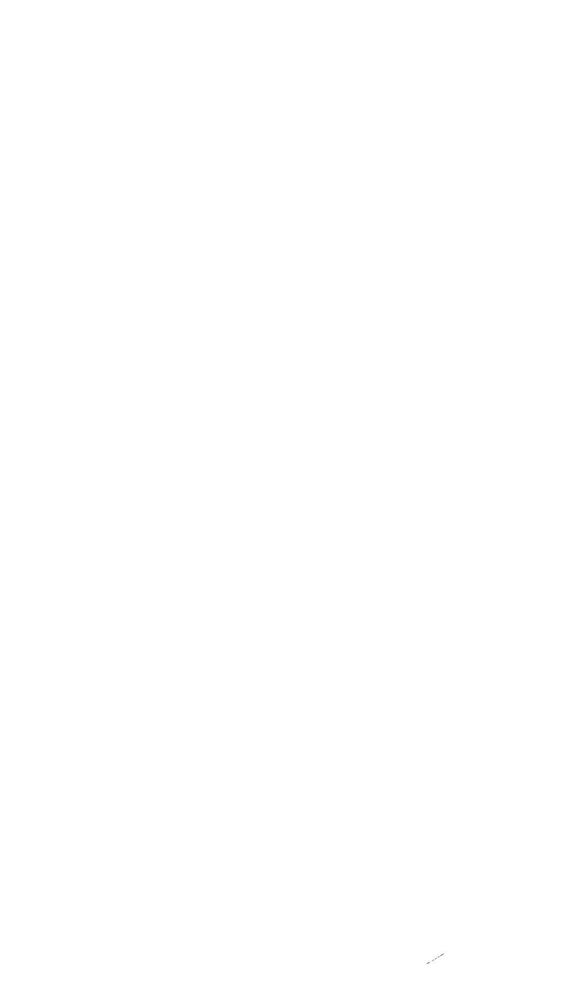

    

<h1 align="center">
    <b>Hi there,</b>
    
</h1>

- Hi 👋🏼, I'm Yogesh Zala, a passionate self-Lerner software developer 👨🏻‍💻 from India.

- I quite enjoy 😀 creating and designing stuff.

    

## :link: Let's Connect

    <a href="https://instagram.com/yogeshzala1511"><code></code></a>&nbsp&nbsp&nbsp&nbsp
    <a href="https://linkedin.com/in/yogeshzala"><code></code></a>&nbsp&nbsp&nbsp&nbsp
    <a href="https://twitter.com/yogeshzala1511"><code></code></a>&nbsp&nbsp&nbsp&nbsp

## :gear: Languages And Tools I Use

    <code></code>&nbsp&nbsp&nbsp&nbsp
    <code></code>&nbsp&nbsp&nbsp&nbsp
    <code></code>&nbsp&nbsp&nbsp&nbsp
    <code></code>&nbsp&nbsp&nbsp&nbsp
    <code></code>&nbsp&nbsp&nbsp&nbsp
    <code></code>&nbsp&nbsp&nbsp&nbsp
    <code></code>&nbsp&nbsp&nbsp&nbsp
    <code></code>&nbsp&nbsp&nbsp&nbsp
    <code></code>&nbsp&nbsp&nbsp&nbsp
    <code></code>&nbsp&nbsp&nbsp&nbsp
    <code></code>&nbsp&nbsp&nbsp&nbsp
    <code></code>&nbsp&nbsp&nbsp&nbsp
    <code></code>&nbsp&nbsp&nbsp&nbsp

## :rocket: My GitHub Stats

    

## :hourglass: My Github Streak

    

## :test_tube: Stuff I Use

    

    

    Made by 👨🏻‍💻 Yogesh Zala

